# Experiment Pipeline: Multi-Problem Neural Architecture Evolution

This document describes the complete experimental pipeline for the 3D Bin Packing DQN with Neurogenesis system, starting from `experiment_multi_problem.py`.

## Pipeline Overview

```mermaid
flowchart TD
    %% Entry Point
    START[<b>experiment_multi_problem.py</b><br/>Main Entry Point] --> LOAD

    %% Phase 0: Data Loading
    LOAD[<b>PHASE 0: Data Loading</b>] --> TRAIN_DATA[Training Problems<br/>IDs: 1,2,3,5,7,...]
    LOAD --> TEST_DATA[Test Problems<br/>IDs: 12,13,...]
    TRAIN_DATA --> DATASET[dataset_loader.py<br/>BinPackingProblem]
    TEST_DATA --> DATASET
    DATASET --> GA_START

    %% Phase 1: Genetic Algorithm
    GA_START[<b>PHASE 1: GA Evolution</b><br/>ga_evolution.py] --> INIT_POP[Initialize Population<br/>20-50 NetworkGenomes]

    INIT_POP --> GA_LOOP{For each<br/>Generation<br/>1-50}

    GA_LOOP --> EVAL_GENOME[<b>For each Genome:</b><br/>evaluate_genome_multi_problem]

    EVAL_GENOME --> GENOME_STRUCT[<b>NetworkGenome Structure:</b><br/>• Architecture Genes:<br/>  - hidden_dim, enc_layers<br/>  - attention_type, attention_heads<br/>  - patch_size, cnn_channels<br/>  - dropout, activation<br/>• Training Hyperparameters:<br/>  - learning_rate, batch_size, gamma]

    GENOME_STRUCT --> TRAIN_GENOME[Round-Robin Training<br/>100 episodes across all training problems]

    TRAIN_GENOME --> FITNESS[Calculate Fitness:<br/>avg_utilization - complexity_penalty]

    FITNESS --> SELECT[Tournament Selection]
    SELECT --> CROSSOVER[Crossover<br/>uniform/single-point]
    CROSSOVER --> MUTATE[Mutation<br/>adaptive rate]
    MUTATE --> ELITE[Elitism<br/>keep top 3]

    ELITE --> GA_LOOP

    GA_LOOP -->|After 50<br/>generations| BEST_GENOME[Best Evolved Genome<br/>highest fitness]

    %% Phase 2: Final Training
    BEST_GENOME --> PHASE2[<b>PHASE 2: Final Training</b>]

    PHASE2 --> BUILD_DQN[Build DQN Agent from Best Genome<br/>dqn_enhanced.py]

    BUILD_DQN --> NN_ARCH[<b>Q-Network Architecture:</b><br/>1. State Encoder MLP<br/>2. HeightmapCNN 7×7 → 64-dim<br/>3. Action Encoder MLP<br/>4. Transformer Attention<br/>5. Q-Value Head]

    NN_ARCH --> TRAIN_FINAL[Train for 2000 Episodes<br/>Round-Robin across Training Problems]

    TRAIN_FINAL --> ENV[<b>MultiBinPackingEnv</b><br/>• EMS-based actions<br/>• Constraint validation<br/>• Heightmap extraction]

    ENV --> REPLAY[Experience Replay Buffer<br/>s, a, r, s', done<br/>+ action features<br/>+ heightmap patches]

    REPLAY --> TRAINED[Trained Model .pth<br/>+ Genome Config .json]

    %% Phase 3: Evaluation
    TRAINED --> PHASE3[<b>PHASE 3: Evaluation</b>]

    PHASE3 --> EVAL_TEST[Evaluate on Test Problems<br/>10 episodes per problem<br/>ε=0 greedy]

    EVAL_TEST --> METRICS[Performance Metrics:<br/>• Bin utilization<br/>• Bins used<br/>• Items packed]

    EVAL_TEST --> VIZ[3D Visualizations:<br/>• Bin packing plots<br/>• EMS visualization]

    METRICS --> RESULTS[<b>Final Outputs:</b><br/>• results.json<br/>• evolution_history.json<br/>• visualizations/]
    VIZ --> RESULTS

    RESULTS --> END[End]

    %% Styling
    classDef entryClass fill:#FF6B6B,stroke:#333,stroke-width:3px
    classDef dataClass fill:#4ECDC4,stroke:#333,stroke-width:2px
    classDef gaClass fill:#95E1D3,stroke:#333,stroke-width:2px
    classDef genomeClass fill:#FFE66D,stroke:#333,stroke-width:2px
    classDef nnClass fill:#FF8C42,stroke:#333,stroke-width:2px
    classDef envClass fill:#A8E6CF,stroke:#333,stroke-width:2px
    classDef trainClass fill:#C7CEEA,stroke:#333,stroke-width:2px
    classDef evalClass fill:#FFDAC1,stroke:#333,stroke-width:2px
    classDef outputClass fill:#B4F8C8,stroke:#333,stroke-width:2px

    class START entryClass
    class LOAD,TRAIN_DATA,TEST_DATA,DATASET dataClass
    class GA_START,INIT_POP,GA_LOOP,SELECT,CROSSOVER,MUTATE,ELITE gaClass
    class GENOME_STRUCT,BEST_GENOME genomeClass
    class BUILD_DQN,NN_ARCH nnClass
    class ENV envClass
    class EVAL_GENOME,TRAIN_GENOME,FITNESS,PHASE2,TRAIN_FINAL,REPLAY,TRAINED trainClass
    class PHASE3,EVAL_TEST,METRICS,VIZ evalClass
    class RESULTS,END outputClass
```



---

## Detailed Component Descriptions

### Phase 0: Data Loading

**Entry Point:** `experiment_multi_problem.py`

**Components:**
- **Dataset Loader** (`nesting/dataset_loader.py`):
  - Loads 3D bin packing problems from `.txt` files
  - Parses bin dimensions, items, constraints
  - Supports multiple problem types (1-15)

**Constraints Loaded:**
- Bin dimensions (W×D×H)
- Max bins allowed
- Max weight per bin
- Item incompatibilities
- Positive affinities
- Center of mass constraints
- Relative positioning rules

---

### Phase 1: Genetic Algorithm Evolution

**Main Module:** `ga_evolution.py`

#### 1.1 Population Initialization
- Creates 20-50 random `NetworkGenome` instances
- Each genome encodes a complete neural architecture

#### 1.2 NetworkGenome Structure (`genome.py`)

**Architecture Genes (evolved):**
| Gene | Type | Range | Description |
|------|------|-------|-------------|
| `hidden_dim` | Multiplicative | 8-512 | Hidden layer dimension |
| `enc_layers` | Multiplicative | 1-8 | Number of encoder layers |
| `head_hidden` | Multiplicative | 16-256 | Q-value head hidden size |
| `attention_type` | Discrete | standard/set_transformer/none | Attention mechanism |
| `attention_heads` | Multiplicative | 2-16 | Number of attention heads |
| `num_inducing_points` | Multiplicative | 8-128 | For set transformer |
| `patch_size` | Multiplicative | 3-15 | Heightmap patch size |
| `cnn_channels` | Discrete | [[8,16], [16,32], [32,64], [16,48]] | CNN architecture |
| `dropout` | Discrete | [0.0, 0.05, 0.1, 0.15, 0.2] | Dropout rate |
| `activation` | Discrete | relu/gelu/silu | Activation function |

**Training Hyperparameters (evolved):**
| Gene | Type | Range | Description |
|------|------|-------|-------------|
| `lr` | Discrete | [1e-5, 5e-5, 1e-4, 5e-4, 1e-3] | Learning rate |
| `batch_size` | Discrete | [64, 128, 256] | Batch size |
| `gamma` | Discrete | [0.98, 0.985, 0.99, 0.992, 0.995] | Discount factor |

**Fixed Parameters (not evolved):**
- `n_step`: 3 (multi-step learning)
- `eps_start`: 1.0, `eps_end`: 0.01
- `target_update_interval`: 200
- `double_dqn`: True
- `warmup_steps`: 300
- `buffer_size`: 200,000 (15,000 during GA)
- `grad_clip`: 1.0

#### 1.3 Fitness Evaluation

**Function:** `evaluate_genome_multi_problem()`

**Process:**
1. Build DQN agent from genome
2. **Round-Robin Training:** Cycle through training problems episode-by-episode
   - Episode 1: Problem 0
   - Episode 2: Problem 1
   - ...
   - Episode N: Problem 0 again
3. **Evaluation:** Run greedy evaluation (ε=0) on ALL training problems
4. **Fitness Calculation:**
   ```
   fitness = avg_utilization - complexity_penalty
   ```
   where:
   - `avg_utilization`: Average bin utilization across all training problems
   - `complexity_penalty`: 0.01 × network_complexity (in millions of parameters)

**Multi-Objective Components:**
- 70% utilization (maximize packing efficiency)
- 20% bins efficiency (minimize bins used)
- 10% parsimony (prefer smaller networks)

#### 1.4 Genetic Operators

**Selection:** Tournament selection (k=3)
- Randomly pick 3 genomes
- Select the one with highest fitness

**Crossover:** Uniform or single-point
- Uniform: Each gene randomly chosen from either parent
- Single-point: Split at random position

**Mutation:** Adaptive mutation rate
- **Multiplicative genes:** Multiply or divide by 2, clamp to bounds
- **Discrete genes:** Random choice from valid options
- **Adaptive rate:** Decays from 0.2 to 0.05 over generations
- **Diversity boost:** Increases if population diversity drops below 5% CoV

**Elitism:** Top 3 genomes preserved

#### 1.5 Adaptive Techniques

**Adaptive Population Sizing:**
- Early phase (first 1/3): 1.5× base size (exploration)
- Middle phase (middle 1/3): 1.0× base size (stable)
- Late phase (final 1/3): 0.75× base size (exploitation)

**Curriculum Learning (optional):**
- Progressive difficulty during evolution
- Start with 30% of items, increase to 100%
- Fewer episodes early (50), more late (100)

---

### Phase 2: Final Model Training

**Purpose:** Train the best evolved architecture for extended period

**Module:** `experiment_multi_problem.py` (Phase 2 section)

#### 2.1 DQN Agent Construction

**Class:** `DQNAgentEnhanced` (`dqn_core/dqn_enhanced.py`)

**Q-Network Architecture:**

```
Input: state (8-dim) + actions (A × 25-dim) + heightmap patches (A × 7×7)

1. State Encoder MLP
   ├─ Input: 8-dim state (packed%, items_left, capacity, avg_height, weight_util, bins_used)
   └─ Output: hidden_dim (e.g., 256)

2. Heightmap CNN (per action)
   ├─ Input: 7×7 heightmap patch around placement position
   ├─ Conv2d(1 → 16, 3×3) → ReLU
   ├─ Conv2d(16 → 32, 3×3) → ReLU
   ├─ AdaptiveAvgPool2d(1×1)
   └─ Output: 64-dim spatial embedding

3. Action Encoder MLP (per action)
   ├─ Input: 25-dim action features + 64-dim heightmap embedding = 89-dim
   │   • Action features: (x,y,z, w,d,h, rot_type, bin_id, bin_util, ...)
   └─ Output: hidden_dim (e.g., 256)

4. Transformer Attention
   ├─ Input: A × hidden_dim (all action embeddings)
   ├─ Self-attention between all actions (learns relationships)
   └─ Output: A × hidden_dim (context-aware action embeddings)

5. Q-Value Head
   ├─ Input: concat(state_emb, action_emb) = 2×hidden_dim
   ├─ MLP(2×hidden_dim → head_hidden → 1)
   └─ Output: Q(s, a) for each action
```

**Key Features:**
- **HeightmapCNN:** Learns spatial patterns (corners, walls, valleys)
- **Transformer Attention:** Actions reason about each other (competition, alternatives)
- **Double DQN:** Uses online network for action selection, target network for evaluation
- **Experience Replay:** 200k buffer with n-step returns (n=3)
- **Epsilon Decay:** Episode-based (robust to variable episode lengths)

#### 2.2 Training Loop

**Duration:** 2000 episodes

**Strategy:** Round-robin across all training problems
- Distributes episodes evenly: Episode i trains on problem (i mod N)
- Ensures balanced experience from all problem types

**Environment:** `MultiBinPackingEnv` (`packing_with_dqncore2_enhanced.py`)

**Action Space:**
- **EMS-based:** Generate placements from Empty Maximal Spaces
- **Constraints validated:**
  - Physical fit (no collisions)
  - Weight limit per bin
  - Incompatibility (items that can't share a bin)
  - Positive affinity (items that must share a bin)
  - Relative positioning (heavy items can't rest on light items)
  - Center of mass constraints

**Reward Structure:**
```python
# Immediate reward
volume_placed = item.w × item.d × item.h
reward = volume_placed / bin_volume

# Terminal reward (when all items placed or no valid actions)
bins_used = count(bins with items > 0)
total_volume_packed = sum(all placed item volumes)
utilization = total_volume_packed / (bins_used × bin_volume)

# Penalty for using more bins
bins_penalty = (bins_used - 1) × 0.1

# Potential-based shaping (optional)
ems_quality_improvement = Φ(s') - Φ(s)

final_reward = utilization - bins_penalty + ems_quality_improvement
```

#### 2.3 Experience Replay

**Buffer Structure:**
```python
{
  's': state (8-dim),
  'a_idx': action index,
  'r': reward (n-step accumulated),
  's_next': next state (8-dim),
  'done': terminal flag,
  'curr_feats': current action features (max_actions × 25),
  'curr_mask': valid action mask (max_actions),
  'curr_patches': heightmap patches (max_actions × 7×7),
  'next_feats': next action features,
  'next_mask': next valid action mask,
  'next_patches': next heightmap patches
}
```

**Training:**
- Batch size: 64-256 (from genome)
- Frequency: Every 5 steps
- Update rule: Smooth L1 loss (Huber loss)
- Gradient clipping: 1.0
- Target network update: Every 200 steps

---

### Phase 3: Evaluation on Test Problems

**Purpose:** Assess generalization to unseen problems

**Process:**
1. Load trained model weights
2. For each test problem:
   - Run 10 greedy episodes (ε=0)
   - Track: utilization, bins used, items packed
   - Save best episode state for visualization
3. Calculate average metrics across all test problems

**Metrics Computed:**
- **Utilization:** `total_volume_packed / (bins_used × bin_volume)`
- **Bins Used:** Number of bins containing at least one item
- **Items Packed:** Total items successfully placed
- **Per-Problem Breakdown:** Individual metrics for each test problem

**Visualizations Generated:**
- **Bin Packing 3D Plots:**
  - Filled view (clean visualization)
  - With EMS overlay (for analysis)
  - One plot per non-empty bin
  - Color-coded items
- **Evolution Plots:**
  - Fitness evolution over generations
  - Utilization trends
  - Complexity trends
  - Diversity scores
  - Convergence analysis

---

## Output Files

### Directory Structure
```
results/experiment_multi_problem/
├── evolution/
│   ├── checkpoint_latest.json          # Resume point
│   ├── generation_001.json             # Generation 1 snapshot
│   ├── generation_002.json             # Generation 2 snapshot
│   ├── ...
│   ├── generation_050.json             # Generation 50 snapshot
│   ├── best_genome.json                # Best evolved genome
│   ├── evolution_history.json          # Complete GA history
│   └── plots/
│       ├── overview_dashboard.png      # Main dashboard
│       ├── fitness_components.png      # Fitness breakdown
│       ├── convergence_analysis.png    # Convergence metrics
│       ├── population_dynamics.png     # Population stats
│       ├── architecture_evolution.png  # Architecture trends
│       └── pareto_analysis.png         # Fitness vs complexity
├── evolved_genome.json                 # Best genome (copy)
├── trained_model.pth                   # Trained DQN weights
├── results.json                        # Final test metrics
└── visualizations_3dBPP_12/            # Test problem visualizations
    ├── bin_1_filled.png
    ├── bin_1_with_ems.png
    ├── bin_2_filled.png
    └── ...
```

### Key Output Files

#### `results.json`
```json
{
  "experiment_type": "multi_problem",
  "training_problem_ids": [1, 2, 3, 5, 7],
  "test_problem_ids": [12, 13],
  "evolution": {
    "generations": 50,
    "base_population_size": 30,
    "best_fitness": 0.8234,
    "best_genome": { ... }
  },
  "training": {
    "episodes": 2000,
    "avg_training_utilization": 0.812
  },
  "testing": {
    "avg_test_utilization": 0.785,
    "avg_test_bins": 3.2,
    "per_problem": [
      {"problem": "3dBPP_12", "utilization": 0.79, "bins": 3.1},
      {"problem": "3dBPP_13", "utilization": 0.78, "bins": 3.3}
    ]
  },
  "architecture": {
    "hidden_dim": 256,
    "enc_layers": 3,
    "attention_type": "standard",
    "complexity": 2.45
  },
  "time_seconds": 18423
}
```

#### `evolution_history.json`
```json
{
  "generation": [1, 2, 3, ..., 50],
  "best_fitness": [0.65, 0.68, 0.71, ..., 0.82],
  "avg_fitness": [0.58, 0.61, 0.64, ..., 0.78],
  "best_utilization": [0.72, 0.75, 0.78, ..., 0.88],
  "avg_complexity": [2.1, 2.3, 2.4, ..., 2.5],
  "diversity_score": [0.85, 0.78, 0.65, ..., 0.42],
  "mutation_rate": [0.20, 0.19, 0.18, ..., 0.05],
  ...
}
```

---

## Key Algorithms

### 1. EMS (Empty Maximal Space) Action Generation

**Purpose:** Efficiently enumerate feasible placements

**Algorithm:**
```python
def enumerate_actions():
    actions = []
    for bin in bins:
        for ems in bin.ems_list (top-k largest):
            for item in remaining_items:
                for rotation in [6 possible rotations]:
                    if fits_in_ems(item, rotation, ems):
                        if satisfies_all_constraints(item, rotation, ems, bin):
                            actions.append((bin_id, item_id, rotation, ems, position))
    return actions
```

**Optimizations:**
- Early stopping: Collect only `max_actions` (e.g., 128)
- Randomized iteration order for diverse sampling
- Top-k EMS selection (e.g., k=32 largest)

### 2. Heightmap Extraction

**Purpose:** Provide spatial context for each action

**Algorithm:**
```python
def extract_heightmap_patch(bin, position, patch_size=7):
    x, y, z = position
    heightmap = bin.heightmap  # 2D array of max z-coordinate at each (x, y)

    # Extract patch centered at (x, y)
    half = patch_size // 2
    patch = heightmap[x-half:x+half+1, y-half:y+half+1]

    # Normalize by bin height
    patch = patch / bin.height

    # Pad if near edges
    if patch.shape != (patch_size, patch_size):
        patch = pad_to_size(patch, patch_size)

    return patch  # (7, 7) normalized heightmap
```

**Usage:** Provides local spatial features for CNN processing

### 3. Constraint Validation

**Incompatibility Check:**
```python
def check_incompatibility(item_id, bin):
    for placed_item in bin.placed:
        if (item_id, placed_item.id) in incompatibilities:
            return False  # Violation
    return True  # OK
```

**Affinity Check (Proactive):**
```python
def check_affinity(item_id, target_bin_idx):
    # Find all affinity partners
    partners = get_affinity_partners(item_id)

    # Check if partners already placed in OTHER bins
    for bin_idx, bin in enumerate(bins):
        if bin_idx == target_bin_idx:
            continue
        for partner in partners:
            if partner in bin.item_ids:
                return False  # Must be in same bin!
    return True  # OK
```

**Weight Check:**
```python
def check_weight(item, bin):
    if bin.max_weight is None:
        return True
    return (bin.current_weight + item.weight) <= bin.max_weight
```

**Relative Positioning:**
```python
def check_relative_position(item, position, bin):
    # Check if placing heavier item on lighter item
    x, y, z = position
    for placed in bin.placed:
        if placed.z + placed.h == z:  # Directly below
            if overlaps_xy(item, position, placed):
                if item.weight > placed.weight:
                    return False  # Heavy on light!
    return True  # OK
```

---

## Performance Considerations

### Computational Bottlenecks

1. **Action Enumeration:**
   - **Problem:** O(bins × EMS × items × rotations) = ~5000 actions/step
   - **Solution:** Early stopping with max_actions=128 (saves 80-90% time)

2. **Heightmap Extraction:**
   - **Problem:** Extract 7×7 patch for each of 128 actions
   - **Solution:** Vectorized NumPy operations, pre-computed heightmaps

3. **Genome Evaluation:**
   - **Problem:** Train 30-50 networks for 100 episodes each
   - **Solution:** Reduced buffer size (15k during GA), GPU acceleration

4. **Replay Buffer:**
   - **Problem:** Store large tensors (heightmap patches)
   - **Solution:** Preallocated NumPy arrays, efficient indexing

### Memory Optimization

- **GA Phase:** Reduce buffer from 200k to 15k
- **Batch Size:** 64-256 (from genome)
- **Garbage Collection:** Explicit cleanup after each genome evaluation

### GPU Utilization

- All neural network operations on GPU (if available)
- Batch training for efficiency
- CUDA memory management (empty cache after genome eval)

---

## Success Metrics

### Evolution Success
- **Convergence:** Best fitness improves over generations
- **Diversity:** Population maintains genetic diversity (>30%)
- **Pareto Front:** Good trade-off between utilization and complexity

### Training Success
- **Learning:** Episode reward increases
- **Utilization:** Bin utilization >75% on training problems
- **Generalization:** Similar performance on test problems

### Architecture Quality
- **Efficiency:** <3M parameters
- **Performance:** Utilization >70% on test problems
- **Robustness:** Consistent across multiple problem types

---

## Troubleshooting

### Common Issues

**Low Diversity in GA:**
- **Symptom:** All genomes converge to similar architectures
- **Solution:** Increase mutation rate or population size

**Training Instability:**
- **Symptom:** Q-values diverge, reward oscillates
- **Solution:** Reduce learning rate, increase target update interval

**Poor Generalization:**
- **Symptom:** Good training performance, bad test performance
- **Solution:** Add more diverse training problems, stronger regularization

**OOM Errors:**
- **Symptom:** CUDA out of memory
- **Solution:** Reduce batch size, buffer size, or population size

---

## References

**Key Papers:**
1. Ding et al. (2010): "Using Genetic Algorithms to Optimize Artificial Neural Networks"
2. Mnih et al. (2015): "Human-level control through deep reinforcement learning" (DQN)
3. Van Hasselt et al. (2016): "Deep Reinforcement Learning with Double Q-learning"
4. Lee et al. (2019): "Set Transformer: A Framework for Attention-based Permutation-Invariant Neural Networks"

**Key Concepts:**
- **Neurogenesis:** Evolution of neural architectures via genetic algorithms
- **EMS (Empty Maximal Spaces):** Efficient representation of feasible placements in 3D packing
- **Multi-objective Optimization:** Balancing utilization, bins used, and network complexity
- **Transfer Learning:** Training on multiple problems to improve generalization

---

## Customization Guide

### Adjusting Evolution Parameters

**File:** `experiment_multi_problem.py`

```python
# Population and generations
population_size = 30        # Increase for more diversity
generations = 50            # More generations = better convergence
episodes_per_eval = 100     # Episodes to evaluate each genome

# Genetic operators
elite_size = 3              # Top genomes preserved
mutation_rate = 0.2         # Initial mutation probability

# Adaptive techniques
adaptive_population = True  # Dynamic population sizing
use_curriculum = True       # Progressive difficulty
```

### Modifying Architecture Search Space

**File:** `genome.py`

```python
GENE_SPACES = {
    'hidden_dim': {'type': 'multiplicative', 'base': 32, 'min': 8, 'max': 512},
    # Add new gene:
    'new_param': [value1, value2, value3],  # Discrete choices
    # Or:
    'new_param': {'type': 'multiplicative', 'base': X, 'min': Y, 'max': Z},
}
```

### Changing Reward Function

**File:** `packing_with_dqncore2_enhanced.py`

```python
def _compute_reward(self):
    # Customize reward components
    utilization_reward = ...
    bins_penalty = ...
    custom_bonus = ...

    return utilization_reward - bins_penalty + custom_bonus
```

---

## Conclusion

This pipeline implements a complete neurogenesis system for 3D bin packing:

1. **Evolution:** GA searches for optimal neural architectures
2. **Training:** Best architecture trained with DQN
3. **Evaluation:** Assess generalization to unseen problems

**Key Innovations:**
- Co-evolution of architecture and hyperparameters
- Heightmap CNN for spatial awareness
- Transformer attention for action relationships
- Multi-problem training for generalization
- Adaptive population and mutation rates

**Result:** High-performing, parameter-efficient DQN agents that generalize across diverse 3D bin packing problems.
